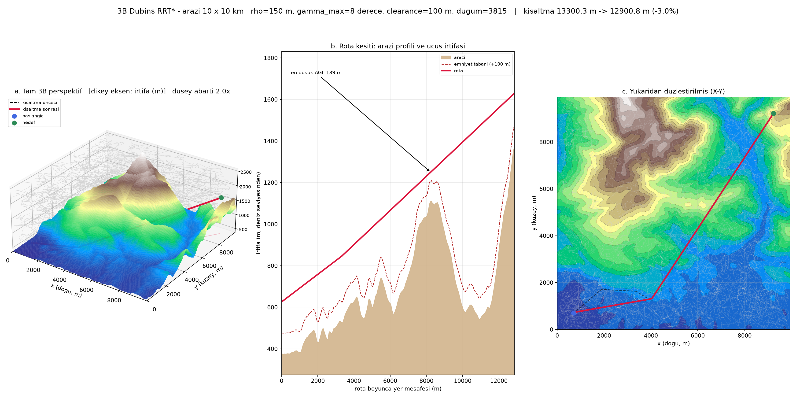

# Fixed-Wing UAV Mission Planner

Place waypoints on a map; the planner produces a three-dimensional route that a
fixed-wing aircraft can **actually fly** — clear of terrain and no-fly zones — and
exports a mission file that Mission Planner and ArduPilot read directly.



*Left to right: 3D route over terrain, terrain profile and flight altitude along
the route (lowest AGL 139 m), top view. The dashed line is the route before
shortcutting.*

The route is not made of straight lines. A fixed-wing aircraft cannot turn on the
spot, has a minimum turn radius, and cannot fly through a mountain. The planner
builds every segment with **Dubins airplane** geometry — either a straight line
or the tightest arc the bank angle allows — and assigns an altitude that keeps
the aircraft clear of the ground.


> **Note on the interface language.** The application's interface is in Turkish.
> Where this document refers to a control, it gives the on-screen label in
> *italics* followed by its English meaning, e.g. *Rotayi planla* (Plan route).

---

## Contents

- [Features](#features)
- [Validation against SITL](#validation-against-sitl)
- [Quick start](#quick-start)
- [Usage](#usage)
- [Settings](#settings)
- [Wind](#wind)
- [How it works](#how-it-works)
- [Mission file](#mission-file)
- [Terrain data](#terrain-data)
- [Repository layout](#repository-layout)
- [Tests](#tests)
- [Building the standalone executable](#building-the-standalone-executable)
- [SITL tooling](#sitl-tooling)
- [Limitations](#limitations)
- [References](#references)

---

## Features

| | |
|---|---|
| **3D terrain avoidance** | With terrain data, the route stays at least the safety margin above ground; it climbs in place with helical turns when needed |
| **2D fallback** | Without terrain, a level route at a single altitude, anywhere in the world; automatic fallback if no 3D route is found |
| **No-fly zones** | Circular zones; in 3D they are cylinders from floor to ceiling and cannot be overflown |
| **Wind** | Realistic flight time under wind; optionally, wind shapes the route itself |
| **Live wind data** | Real forecast profile from Open-Meteo, including how speed and direction change with altitude |
| **Two route objectives** | Shortest path (distance) or shortest time (using the wind's altitude profile) |
| **Loiter** | Hold at chosen waypoints for a given number of seconds; written as `NAV_LOITER_TIME` |
| **Mission file** | `QGC WPL 110` — opened directly by Mission Planner and ArduPilot |
| **Airspeed conversion** | Computes the indicated airspeed (`AIRSPEED_CRUISE`) to set on the autopilot for the flight altitude |
| **Visualisation** | Route on the map, accelerated flight playback, 3D panel |

The application runs entirely locally and uses **only the Python standard
library**. It reaches the internet for two things only — downloading missing
terrain and, optionally, fetching a wind forecast — and neither is required.

---

## Validation against SITL

The planner's predicted flight time was compared with the time the real ArduPlane
firmware took to fly the same mission in software-in-the-loop simulation (SITL):

| Scenario | Distance | Prediction vs. flight |
|---|---:|---:|
| Alps | 26 km | −0.8% |
| Istanbul | 6.3 km | +0.7% |
| Şile | 12.6 km | −0.3% |
| Alps | 102 km | −0.9% |
| Alps | 120 km | −0.26% |

All five flights are **within 1%**. Loiter was measured too: with a 120-second
hold the prediction was 656.1 s against 685.5 s flown (+4.5%). The difference
comes from the autopilot's loiter radius (`WP_LOITER_RAD`) and is deliberately not
modelled.

> These flights validate the **shortest path** objective under uniform wind. The
> flight-time prediction of the **shortest time** objective has **not yet** been
> validated in SITL.

---

## Quick start

**Requires:** Python 3.10 or newer (developed on 3.12). The application itself
needs no `pip install`.

```bash
git clone https://github.com/OzanOzyurt10/autonomous_uav_path_planning.git
cd autonomous_uav_path_planning
python -m app.server
```

Open **http://127.0.0.1:8000/** in a browser. Closing the terminal that runs the
server stops the application.

On Windows, with a virtual environment in place, it can also be started by
double-clicking:

```bat
python -m venv venv
Planlayiciyi Baslat.bat
```

`Planlayiciyi Baslat.bat` checks for the virtual environment and runs
`launch.py`, which starts the server and opens the browser.

| Entry point | Command | Browser |
|---|---|---|
| Development | `python -m app.server` | Open it yourself |
| Shortcut (Windows) | `Planlayiciyi Baslat.bat` | Opens automatically |
| Distribution | `GorevPlanlayici.exe` ([build](#building-the-standalone-executable)) | Opens automatically |

---

## Usage

1. **Place waypoints.** In the right-hand rail, press *Waypointler › Ekle*
   (Waypoints › Add) and click on the map. The tool stays armed so you can place
   several points; press `Esc` when done. At least 2, at most 12 points.
2. **Enter the wind.** In the *Ucus kosullari* (Flight conditions) block, enter
   the speed and the direction the wind blows **from** (270 = from the west). Or
   turn on the *anlik ruzgar verisi* (live wind data) switch.
3. **Check the aircraft settings once.** Speed, bank, climb and safety margin
   live in *Ucak ve emniyet* (Aircraft and safety). The browser remembers them.
4. **Plan the route.** Press *Rotayi planla* (Plan route) in the top bar. It
   takes a few seconds.
5. **Download the mission file.** *Gorev dosyasi* (Mission file) downloads
   `gorev_<timestamp>.waypoints`.

> **Before flying:** the `AIRSPEED_CRUISE` value in the bottom bar differs from
> the speed you entered, and it is the one to set on the autopilot. See
> [Mission file](#mission-file).

### On the map

| Action | How |
|---|---|
| Add a waypoint | *Ekle* (Add) → click on the map |
| Move a waypoint | Drag it, or select it and use the arrow keys (6-pixel steps; `Shift` for 6×) |
| Draw a no-fly zone | *Ekle* (Add) → drag outward from the centre (a plain click gives an 800 m radius) |
| Cancel | `Esc` |

### Waypoint table

| Column | Meaning | If left empty |
|---|---|---|
| *enlem / boylam* (lat / lon) | Position, decimal degrees | — |
| **AGL m** (*kot m* in 2D) | Height above ground; a value pins the waypoint to that height | Safety margin + 100 m |
| *yon°* (heading) | Heading when passing the point, compass degrees | Chosen by the planner |
| *bekle s* (hold) | Loiter time at the point, seconds | No hold |

> The unit of the altitude column depends on the mode: **AGL** (above ground) in
> 3D, **MSL** altitude in 2D — a single value for the whole route. The column
> header changes accordingly.

### Result gauges

| Gauge | Meaning |
|---|---|
| *uzunluk* (length) | 3D route length, km |
| *ucus suresi* (flight time) | Its label says which time it is: calm air or with wind; includes loiter |
| *en dusuk agl* (lowest AGL) | Closest approach to the ground; *agl yok* when there is no terrain |
| *bacak* (legs) | Number of planned legs; a leg that could not be planned is drawn dashed |
| `AIRSPEED_CRUISE` | Indicated airspeed to set on the autopilot |

---

## Settings

| Setting | Default | Range | What it affects |
|---|---:|---:|---|
| wind speed | 0 m/s | 0–40 | Flight time; with the *shortest time* objective, the route as well |
| wind direction | 270° | 0–360 | Direction the wind blows **from** |
| route objective | shortest path | path / time | Whether distance or time is minimised |
| live wind data | off | on / off | Wind from the forecast or entered by hand |
| speed | 28 m/s | 5–120 | **True** airspeed (TAS); turn radius, flight time, wind triangle |
| bank | 30° | 5–60 | Turn radius |
| climb | 8° | 1–45 | Maximum climb/descent angle in 3D |
| safety margin | 10 m | 0–1000 | Vertical margin over terrain, horizontal margin around zones, automatic altitude |
| ignore terrain | off | on / off | Force 2D planning |

The turn radius is not an input; it is derived from speed and bank:

```
rho = v² / (g · tan(bank))          ≈ 138 m at 28 m/s and 30°
```

Automatic altitude:

```
altitude = ground + safety margin + 100 m
```

In 3D each waypoint uses its own ground elevation; in 2D the whole route uses
the highest point in the planning window.

### Fixed limits

| | Value | Why |
|---|---:|---|
| Waypoints | 12 | Each leg is a separate planning run |
| No-fly zones | 24 | — |
| Loiter | 3600 s | — |
| Planning window | 100 km | Terrain resolution and memory |
| Ceiling allowance | 300 m | Climbing room above the automatic altitude |
| Minimum zone radius | 150 m | Anything smaller is a drawing accident |

---

## Wind

### Two route objectives

| Objective | Minimises | Role of the wind |
|---|---|---|
| **shortest path** (default) | Distance | Does **not** change the route; only enters the flight time |
| **shortest time** | Time | **Shapes** the route: climbs into a tailwind, descends toward the terrain in a headwind |

That the wind does not change the route under *shortest path* is not a gap but
physics: by **Zermelo's navigation problem** (1931), the minimum-time path through
a uniform flow is still a straight line. A wind that is the same everywhere
changes only the time taken. This was measured on four scenarios — the route did
not move by a single metre.

The route changes only when the wind **varies with altitude**. Then the altitude
flown becomes a cost:

| Scenario | Route | Time saved |
|---|---|---:|
| Flat terrain, 20 km, tailwind | climbed from 200 m to 712 m | 12.2% |
| Flat terrain, 20 km, headwind | descended from 500 m to a mean of 257 m | 29.7% |
| Alpine terrain, 21 km, tailwind | mean 1318 m → 1220 m | 4.7% |

Both routes in each pair were evaluated under the **same** wind field. The Alpine
gain is smaller because the route is already high above ground, above most of
the shear layer.

### Wind models

| Model | When | How |
|---|---|---|
| `UniformWind` | Shortest path | The same vector at every altitude |
| `ShearWind` | Shortest time, manual entry | Power law `u(h) = u₁₀ · (h/10)^0.14`, h above ground; held constant above 500 m AGL |
| `ProfileWind` | Shortest time, live data | **Vector** interpolation between measured levels |

Under *shortest time*, a manually entered speed is the wind **10 m above
ground** — the height at which meteorological services report it.

### Live wind data

When the switch in the *Ucus kosullari* (Flight conditions) block is on, the wind
is fetched from [Open-Meteo](https://open-meteo.com/) (free, no API key) for the
**centroid of the waypoints**. The coordinate used is shown on screen, the
forecast is re-fetched when waypoints change, and the wind inputs are locked.

A real profile does not look like a power law:

| Height | Speed | Direction |
|---:|---:|---:|
| 115 m | 3.4 m/s | 36° |
| 575 m | 5.8 m/s | 34° |
| 803 m | 5.3 m/s | 40° |
| 1525 m | 4.0 m/s | 65° |

*Riva, Istanbul, 10 September.* Speed peaks and then falls, and the direction
veers by 33° over 1.5 km; a power law produces neither.

Two details: the 10 m and 100 m values are measured **above ground**, the
pressure levels (1000–850 hPa) **above sea level**, and all are moved onto the
sea-level axis. Over high terrain the lower pressure levels lie underground
(in the Alps, with the ground at 506 m, the 1000 hPa level sat at 155 m) and are
discarded.

---

## How it works

### The mode is chosen automatically

- With terrain: **3D** — a route that avoids terrain and zones
- Without terrain: **2D** — a level route at one altitude, anywhere
- If no 3D route is found, it **falls back to 2D** and the interface says so

### Three stages per leg

```
RRT*  ──►  shortcut  ──►  several seeds, keep the cheapest
```

1. **RRT\*** grows a tree of Dubins airplane edges to find a collision-free route.
   The iteration budget starts low (400 → 1200 → 3000) and stops once a route is
   found.
2. **Shortcutting** removes unnecessary detours. This stage is what really sets
   route quality — which is why seeds are compared **after** it.
3. **Multiple seeds:** each leg is planned with 8 random seeds and the cheapest
   is kept; the search stops early once within 10% of the lower bound.

With a single seed, the cost of the same leg ranged from 1.13 to 2.44 times the
lower bound. Keeping the best of eight shortened routes by **19.3%**; planning
time rose from 3 to 10 seconds. Seeds are derived from a fixed base, so the same
input always gives the same route.

### Cost model

What the planner minimises is passed in as a `CostModel`: length (`LENGTH`) or
flight time under wind (`wind_cost`). The model reaches RRT\*'s parent selection,
rewiring, shortcutting and the pruning lower bound. The cost shown in the
interface is always in **metres**.

---

## Mission file

`QGC WPL 110`, frame `MAV_FRAME_GLOBAL` — all altitudes are **above mean sea
level**.

| Row | Command | When |
|---|---|---|
| Home | `16 NAV_WAYPOINT` | Always, first row |
| Take-off | `22 NAV_TAKEOFF` | By default, 15° climb |
| Route point | `16 NAV_WAYPOINT` | Points without a hold |
| Hold | `19 NAV_LOITER_TIME` | Points with a loiter time |

The route consists of hundreds of sampled poses; it is written thinned so that
it never deviates more than **5 m** from the full route. Hold points are exempt
from thinning.

> In Mission Planner, check that the altitude column reads **Abs**. Switching it
> to *Relative* shifts the whole mission.

### Why AIRSPEED_CRUISE differs

The planner works with **true** airspeed (TAS); the autopilot's pitot tube
measures **indicated** airspeed (IAS), which reads low at altitude because the
air is thinner:

```
IAS = TAS × σ
σ   = (1 − 2.25577·10⁻⁵ · h)^4.2559        h: altitude, m
```

The first SITL flight assumed `√σ` and was off by **7.1%**; with the correct
relation `AIRSPEED_CRUISE` dropped from 26.44 to 24.99 and the error fell to
**0.87%**. This value is not in the mission file — it is set on the autopilot as
a **parameter**.

---

## Terrain data

- **Local tiles** are read from the `data/` folder (`.hgl` format).
- **Missing areas** are downloaded from the public
  [Terrarium elevation tiles on AWS](https://registry.opendata.aws/terrain-tiles/)
  and cached under `data/cache/`. Planning the same area again needs no internet.
- **Without internet** the application still runs and plans that area in 2D.

> The `data/` folder is **not** in the repository (`.gitignore`). On a fresh
> clone, terrain is downloaded on the first plan.

The planning window is derived from the waypoints' bounding box, padded by at
least 2 km or four turn radii. As the window grows, the grid spacing coarsens
(90 m at finest) and the interface reports it.

---

## Repository layout

```
app/
  server.py          HTTP server and the request → route decision chain
  mission.py         multi-leg planning, altitude rules, cost models
  static/            browser interface (index.html, app.js, vendored plotly)
src/
  dubins.py          2D Dubins paths (Shkel & Lumelsky 2001)
  dubins3d.py        Dubins airplane: horizontal Dubins + climb + helix
  rrt_star.py        2D RRT*, shortcutting, cost model
  rrt_star3d.py      3D RRT*
  environment*.py    2D / 3D environment: bounds, obstacles, terrain floor
  terrain.py         terrain grid and tile library
  terrarium.py       downloads Terrarium tiles and resamples them to the grid
  png.py             dependency-free PNG decoder (for Terrarium tiles)
  geo.py             latitude/longitude ↔ local metre frame
  wind.py            wind fields and the wind triangle
  forecast.py        Open-Meteo wind profile
  wpl.py             QGC WPL 110 mission file and thinning
tests/               pytest suite
tools/               SITL flight driver, log report, SITL setup helper
notebooks/           algorithm demos (numpy / matplotlib / plotly)
results/             demo output
docs/superpowers/    design documents and implementation plans
launch.py            distribution entry point: server + browser
Çalıştırma Komutları.md   SITL and packaging commands (Turkish)
```

Code comments and docstrings are in Turkish.

---

## Tests

```bash
pip install -r requirements.txt
python -m pytest -q
```

```
1043 passed, 8 skipped
```

The 8 skipped tests are Dubins path types (LSR / RSL) that are geometrically
invalid for particular pose pairs. The suite never touches the network: terrain
and wind sources are replaced by injectable fakes.

`requirements.txt` is for tests and demos only; the application itself runs on
the standard library.

---

## Building the standalone executable

A single file that runs on Windows machines without Python:

```bat
pip install pyinstaller
python -m PyInstaller --noconfirm --onefile ^
    --name "GorevPlanlayici" --add-data "app/static;app/static" ^
    --console launch.py
```

Then place the terrain folder next to it in `dist/`:

```
dist/
  GorevPlanlayici.exe
  data/
    cache/
```

`data` sits **beside** the executable rather than inside it because the cache
must be writable.

---

## SITL tooling

The scripts under `tools/` validate missions against ArduPilot SITL (run under
WSL):

| Script | Purpose |
|---|---|
| `sitl_setup.py` | Builds the SITL launch commands from a mission file and the wind/airspeed values |
| `fly_mission.py` | Uploads the mission with pymavlink, arms and launches, and times the flight |
| `log_report.py` | Extracts true airspeed and leg times from a DataFlash `.BIN` log |

Step-by-step commands are in [`Çalıştırma Komutları.md`](Çalıştırma%20Komutları.md)
(Turkish).

---

## Limitations

- **Wind is horizontally uniform.** It varies with altitude but is the same
  everywhere on the map; local effects such as valley winds are not modelled.
- **Wind does not change over time.** It is assumed constant for the flight.
- **Dubins paths are an approximation in wind.** The exact minimum-time solution
  uses trochoids rather than circular arcs (Techy & Woolsey 2009). The error grows
  with the wind-to-airspeed ratio; since SITL error stays under 1%, the
  approximation is kept.
- **Energy is not a separate objective.** At constant airspeed, energy = power ×
  time, so minimising energy gives the same result as minimising time. Separating
  them would require modelling vertical air motion (thermals, ridge lift).
- **The shortest-time objective is not yet validated in SITL.**
- **A forecast is not an observation.** Live wind is a weather forecast; confirm
  it with a ground station before a real flight.

---

## References

- L. E. Dubins, *On Curves of Minimal Length with a Constraint on Average
  Curvature*, American Journal of Mathematics, 1957.
- A. M. Shkel, V. Lumelsky, *Classification of the Dubins set*, Robotics and
  Autonomous Systems, 2001.
- S. Karaman, E. Frazzoli, *Sampling-based algorithms for optimal motion
  planning*, International Journal of Robotics Research, 2011.
- M. Owen, R. W. Beard, T. W. McLain, *Implementing Dubins Airplane Paths on
  Fixed-Wing UAVs*, Handbook of Unmanned Aerial Vehicles, 2015.
- E. Zermelo, *Über das Navigationsproblem bei ruhender oder veränderlicher
  Windverteilung*, ZAMM, 1931.
- L. Techy, C. A. Woolsey, *Minimum-time path planning for unmanned aerial
  vehicles in steady uniform winds*, Journal of Guidance, Control, and Dynamics,
  2009.
- [Open-Meteo](https://open-meteo.com/) — wind forecasts
- [Terrain Tiles on AWS](https://registry.opendata.aws/terrain-tiles/) —
  Terrarium elevation tiles
